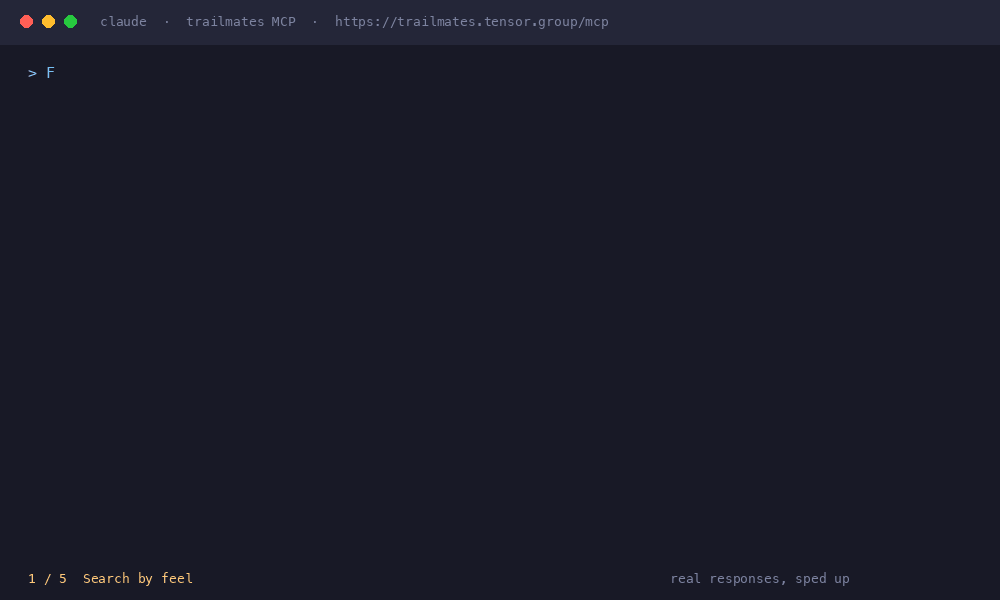

# Demo script

The recording above is a terminal-style GIF rendered from real responses: the five prompts below were run with `claude -p` against the live server (https://trailmates.tensor.group) from a signed-in session, and each answer on screen is the saved output of that run. Each real run took 7 to 12 seconds; the GIF is sped up. The demo hike was deleted at the end of the run (step 5). This page is the script it follows: five prompts typed into Claude Code with the `trailmates` server connected.

Setup: connect the client (`claude mcp add --transport http trailmates <your-url>/mcp`), run `/mcp` in Claude Code and choose to authenticate, approve the consent page, then sign in with GitHub. Do not show tokens, and crop or blur the GitHub handle.

## 1. Search by meaning

> Find me a shaded creek walk with a waterfall. Keep it to 4 short bullets with the status and address.

Expected: `search_hikes` returns open or verify trails with their approximate trailhead addresses. Waterfall and creek trails such as Solstice Canyon and Escondido Falls come back with status `verify` (unconfirmed in the seed). The closed Eaton Canyon entrances and Millard Falls are not listed. `hidden_closed` counts closed trails that would otherwise have ranked among these results; when it is above 0 the response also carries a note saying how to see them.

## 2. Ask for closed trails

> Search for Eaton Canyon waterfall hikes, including closed trails. Keep it to 3 short bullets with the status and the date it is closed through.

Expected: `search_hikes` is called with `include_closed` set to true. The two Eaton Canyon entrances (and Millard Falls) come back with status `closed` and `closed_through` of 2027-12-31, and `hidden_closed` is 0.

## 3. Add a private hike

> Add a private hike called Demo Loop in Altadena: a 1.5 mile easy loop starting at the end of Maple St (Maple St, Altadena, CA 91001), tags sunny and friendly, described as 'A sweet little demo loop.' Reply in one short line.

Expected: `add_hike` returns an id starting with `u:` and the message "Saved. It usually appears in search within seconds, occasionally a minute or more; searching by its exact name works immediately."

## 4. Find it by name

> Find my hike called Demo Loop. Reply in one short line.

Expected: `search_hikes` with the query "Demo Loop" returns the hike first, with source `private`, flagged as an exact name match. The exact-name lookup reads D1 directly, so it works even before the hike's embedding is searchable.

## 5. Delete it

> Delete my Demo Loop hike. Reply in one short line.

Expected: `delete_hike` is called with the hike's id and replies with that id and `"message": "Deleted."`. A repeat search for "Demo Loop" no longer returns it.
